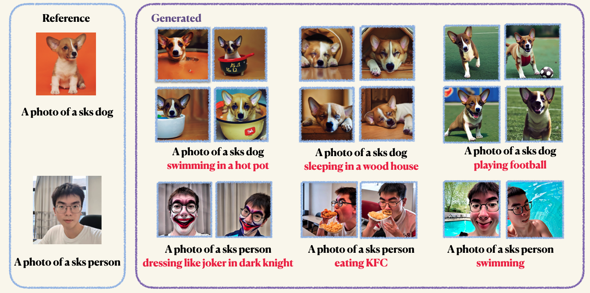

# Structured DreamBooth with LoRA

## 1.Introduction
- This is a naive adaption of [DreamBooth_LoRA by Hugging Face🤗](https://github.com/huggingface/diffusers/blob/main/examples/dreambooth/train_dreambooth_lora.py) with the following modifications:
  - Structured code: We re-structured the original code into different modules, including `models`, `datasets`, `engines`, `tools`, `utils`, to make it more readable and maintainable, and can be easily extended to other tasks.
  - Detailed comments: We added detailed comments to the code to make it easier to understand
  


## 2.Installation
- Install dependencies
    ```bash
    conda create -n dreambooth python=3.8
    conda activate dreambooth
    # install pytorch
    pip install torch==1.12.1+cu113 torchvision==0.13.1+cu113 --extra-index-url https://download.pytorch.org/whl/cu113
    # install diffusers from source
    pip install git+https://github.com/huggingface/diffusers
    pip install -r requirements.txt
    ```

## 3.Training
### 3.1. Train with default settings (Recommended)
- This will train the model with default settings, including 512x512 resolution, 8GB GPU memory occupied, 1 image per batch, 1 gradient accumulation step, 2e-4 learning rate, 150 training steps, 4 validation epochs. We find this setting is enough to generate high-quality images.
- `Step1`: Prepare your custom images and put them in a folder. Normally, 5 to 10 images are enough. We recommend you to mannuallly crop the images to the same size, e.g., 512x512, to avoid unwanted artifacts.
- `Step2`: Initialize a Accelerate environment. [Accelerate](https://huggingface.co/docs/accelerate) is a PyTorch library that simplifies the process of launching multi-GPU training and evaluation jobs. It is developed by Hugging Face. 
  ```bash
  accelerate config
  ```
- `Step3`: Run the training script. Both checkpoints and samples will be saved in the `work_dirs` folder. **Normally, it only takes 1-2 minutes to fine-tune the model with only 8GB GPU memoroccupied**. ***150 epochs are enough to train a object, however, when training on human face, we recommend you to train for 800 epochs. The hyper-parameters of Dreambooth is quite sensitive, you can refer to the [original blog](https://huggingface.co/blog/dreambooth) for some insights.***
  ```bash
  accelerate launch main.py \
  --pretrained_model_name_or_path="runwayml/stable-diffusion-v1-5" \
  --instance_data_dir="imgs/dogs" \
  --instance_prompt="a photo of sks dog" \
  --validation_prompt="a photo of sks dog is swimming" \
  --with_prior_preservation \
  --class_prompt=='a photo of dog' \
  --resolution=512 \
  --train_batch_size=1 \
  --gradient_accumulation_steps=1 \
  --learning_rate=2e-4 \
  --max_train_steps=150 \
  --validation_epochs 4
  ```

### 3.2. Training with prior-preserving loss
Prior preservation is used to avoid overfitting and language-drift (check out the [paper](https://arxiv.org/abs/2208.12242) to learn more if you’re interested). For prior preservation, you use other images of the same class as part of the training process. The nice thing is that you can generate those images using the Stable Diffusion model itself! The training script will save the generated images to a local path you specify.
  ```bash
  accelerate launch main.py \
  --pretrained_model_name_or_path="runwayml/stable-diffusion-v1-5" \
  --instance_data_dir="imgs/dogs" \
  --instance_prompt="a photo of sks dog" \
  --validation_prompt="a photo of sks dog is swimming" \
  --resolution=512 \
  --train_batch_size=1 \
  --gradient_accumulation_steps=1 \
  --learning_rate=2e-4 \
  --max_train_steps=150 \
  --validation_epochs 10
  ```

### 3.3. Training with the text encoder (Not Recommended)
You can aslo fine-tune the text encoder (CLIP) with LoRA. However we find this leads to unconverged results. This phenomenon is opposite to the results reported in the [Original Implementation](https://huggingface.co/blog/dreambooth)
  ```bash
  accelerate launch main.py \
  --pretrained_model_name_or_path="runwayml/stable-diffusion-v1-5" \
  --instance_data_dir="imgs/dogs" \
  --instance_prompt="a photo of sks dog" \
  --validation_prompt="a photo of sks dog is swimming" \
  --with_prior_preservation \
  --train_text_encoder \
  --class_prompt=='a photo of dog' \
  --resolution=512 \
  --train_batch_size=1 \
  --gradient_accumulation_steps=1 \
  --learning_rate=2e-4 \
  --max_train_steps=150 \
  --validation_epochs 4
  ```

## 4.Inference
After training, you can use the following command to generate images from a prompt.
 ```bash
  accelerate launch main.py \
  --pretrained_model_name_or_path="runwayml/stable-diffusion-v1-5" \
  --checkpoint_dir=$CHECKPOINT_DIR \
  --prompt="PROMPT" \
  --output_dir=$OUTPUT_DIR
  ```


## Reference
- [Training Stable Diffusion with Dreambooth using 🧨 Diffusers](https://huggingface.co/blog/dreambooth)
- [diffusers/examples/dreambooth/train_dreambooth_lora.py](https://github.com/huggingface/diffusers/blob/main/examples/dreambooth/train_dreambooth_lora.py)
